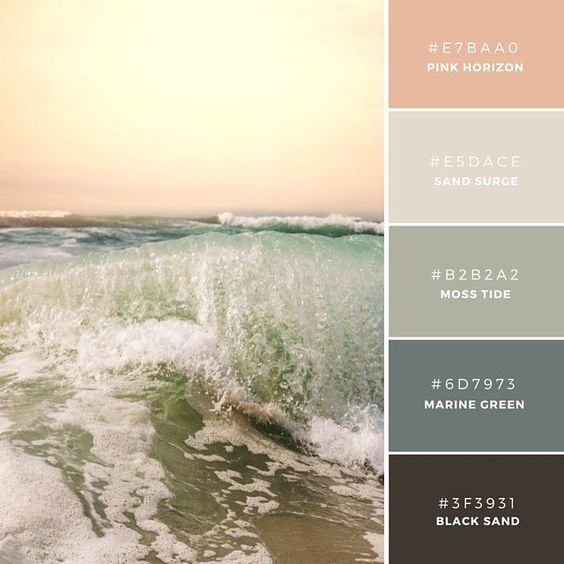

# My 4th README.md
## `By Natalie Elizabeth Boose`
___

#### What is the information this page aims to deliver?
Ultimately, I aim to deliver a comprehensive guide on wireframes and how they can be helpful when designing responsive web pages.
#### What is the first information on the page that should draw the eye?
The first information on the page that should draw the eye is my primary content as well as a paired image. This, I believe will be the most aesthetically pleasing option.
#### What is the primary content of this page?
The primary content of this page will be a brief description of wireframes and why they are important to RWD.
#### What is the secondary content?
A list of online wireframe tools.

---

##### <u>LIST OF CONTENT ITEMS:</u>
1) IMAGE: 
2) CONTENT:  
###### <u>What?</u> 

When a designer begins brainstorming a website, most likely he will begin by figuring out what will appear on each page. This can be visualized through the creation of a wireframe. Basically a wireframe will give the designer a roadmap of where each element (i.e. logo, navigation, images, headings, blocks of text . . .) of the page will live.
 

Everything included in the wireframe is meant to be very basic and uncolorful. The main point is to focus on layout and content placement, as well as solving navigation and functionality problems in a format that is easy to adjust.
 
###### <u>Why?</u>

By creating a wireframe, the designer of a website can make sure that he includes everything he wants to include in his new web page.
 

Also, the production of a wireframe also makes the designer think about how his website is going to display on narrow widths (since 50% of online users are via their mobile devices). Planning things out helps the designer prioritize site elements that should draw the eye of the webiste user whether its on a narrow screen or a wider screen (desktop or tablet).
 
###### <u>Where?</u>

To begin with, it may be smart to sketch a wireframe on paper. You can always erase this way! If you want to stay green, there are many online tools a designer can use, such as (http://gomockingbird.com), (http://lovelycharts.com), (https://www.sketchapp.com/), (https://www.omnigroup.com/omnigraffle/), or (https://www.axure.com/).
 
3) FONTS: Quicksand Light & Jacques Francois  
4) COLOR SCHEME:  
5) TENATIVE WIREFRAME:  
